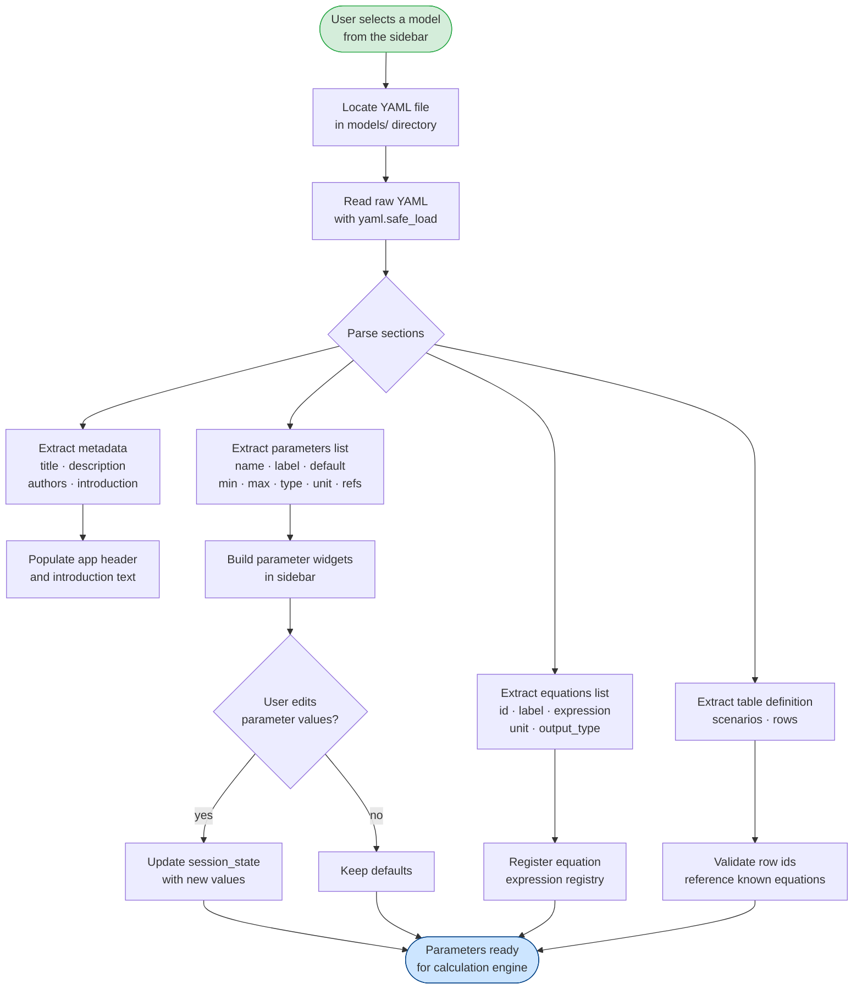
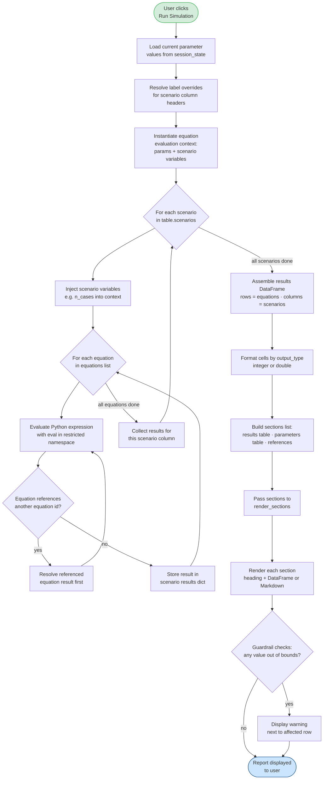

# Design Proposal: YAML-Driven Cost Calculator

This document is the design proposal responding to
[Discussion #2](https://github.com/EpiForeSITE/epiworldPythonStreamlit/discussions/2).
It covers:

1. [YAML File Specification](#1-yaml-file-specification)
2. [Report Structure Specification](#2-report-structure-specification)
3. [Workflow: Reading and Parsing YAML Files](#3-workflow-reading-and-parsing-yaml-files)
4. [Workflow: Building the Cost Calculator](#4-workflow-building-the-cost-calculator)

---

## 1. YAML File Specification

Each disease model is described by a single YAML file.  The file has four
top-level sections: `metadata`, `parameters`, `equations`, and `table`.

### 1.1 Full annotated template

```yaml
# ──────────────────────────────────────────────────
# METADATA
# Free-text fields that describe the model.
# ──────────────────────────────────────────────────
metadata:
  title: "Measles Outbreak Cost Calculator"          # short title shown in the UI
  description: >                                     # one-paragraph plain-text summary
    Estimates the economic cost of a measles
    outbreak across three outbreak-size scenarios.
  authors:
    - "Jane Doe <jane@example.org>"
    - "John Smith"
  introduction: |                                    # longer Markdown text shown before the results
    ## Background
    Measles is a highly contagious viral disease …

    ## Assumptions
    All wage figures are in 2024 USD and are taken
    from the Bureau of Labor Statistics.

# ──────────────────────────────────────────────────
# PARAMETERS
# Each entry becomes an editable widget in the
# sidebar.  Values entered by the user are injected
# into equation expressions at run time.
# ──────────────────────────────────────────────────
parameters:
  - name: cost_hosp                                  # internal identifier (valid Python identifier)
    label: "Cost of measles hospitalization"         # human-readable label shown in the UI
    description: >                                   # tooltip text
      Average direct medical cost per hospitalised
      measles case (USD).
    default: 31168                                   # numeric default value
    min: 0                                           # minimum allowed value
    max: 500000                                      # maximum allowed value
    unit_label: "USD"                                # unit shown next to the widget
    type: integer                                    # integer | double
    references: >
      Ortega-Sanchez et al. (2014). Vaccine, 32(34).

  - name: prop_hosp
    label: "Proportion of cases hospitalised"
    description: "Fraction of confirmed cases requiring hospital admission."
    default: 0.20
    min: 0.0
    max: 1.0
    unit_label: "proportion"
    type: double
    references: "CDC Measles surveillance data 2019."

  - name: wage_worker
    label: "Hourly wage for worker"
    description: "Mean hourly wage used to value lost productivity."
    default: 29.36
    min: 0.0
    max: 200.0
    unit_label: "USD/hr"
    type: double
    references: "U.S. Bureau of Labor Statistics (2024)."

  - name: wage_tracer
    label: "Hourly wage for contact tracer"
    description: "Mean hourly wage of a public-health contact tracer."
    default: 40.00
    min: 0.0
    max: 200.0
    unit_label: "USD/hr"
    type: double
    references: ""

  - name: hrs_tracing
    label: "Hours of contact tracing per contact"
    description: "Average time a tracer spends per identified contact."
    default: 0.832
    min: 0.0
    max: 40.0
    unit_label: "hours"
    type: double
    references: ""

  - name: contacts_per_case
    label: "Number of contacts per case"
    description: "Average number of contacts identified per confirmed case."
    default: 141.5
    min: 0
    max: 2000
    unit_label: "people"
    type: double
    references: ""

  - name: vacc_rate
    label: "Vaccination rate in community"
    description: "Fraction of the population with protective immunity."
    default: 0.80
    min: 0.0
    max: 1.0
    unit_label: "proportion"
    type: double
    references: ""

  - name: quarantine_days
    label: "Length of quarantine"
    description: "Number of days a susceptible contact must quarantine."
    default: 21
    min: 0
    max: 60
    unit_label: "days"
    type: integer
    references: "CDC quarantine guidance."

  - name: missed_ratio
    label: "Proportion of quarantine days that are missed workdays"
    description: >
      Fraction of quarantine days during which the contact cannot work
      (accounts for weekends, remote-work capacity, etc.).
    default: 0.50
    min: 0.0
    max: 1.0
    unit_label: "proportion"
    type: double
    references: ""

# ──────────────────────────────────────────────────
# EQUATIONS
# Named expressions evaluated in Python.
# The expression string may reference any parameter
# `name` defined above plus the special variable
# `n_cases`, which is supplied by the scenario
# column definition (see Table section).
# ──────────────────────────────────────────────────
equations:
  - id: eq_hosp                                      # internal identifier referenced by the table
    label: "Hospitalisation cost"                    # human-readable label for table rows
    equation: "n_cases * prop_hosp * cost_hosp"      # Python expression
    unit_label: "USD"
    output_type: integer                             # integer | double

  - id: eq_lost_prod
    label: "Lost productivity"
    equation: >
      n_cases * contacts_per_case * (1 - vacc_rate)
      * quarantine_days * missed_ratio * wage_worker * 8
    unit_label: "USD"
    output_type: integer

  - id: eq_tracing
    label: "Contact tracing cost"
    equation: "n_cases * contacts_per_case * hrs_tracing * wage_tracer"
    unit_label: "USD"
    output_type: integer

  - id: eq_total
    label: "TOTAL"
    equation: "eq_hosp + eq_lost_prod + eq_tracing"  # equations may reference other equation ids
    unit_label: "USD"
    output_type: integer

# ──────────────────────────────────────────────────
# TABLE
# Describes how to lay out the results table.
#
# `scenarios` defines the columns (beyond the row-
# label column).  Each scenario must supply any
# free variables that appear in the equations but
# are not listed as parameters – typically n_cases.
#
# `rows` selects which equations appear as rows and
# in which order.
# ──────────────────────────────────────────────────
table:
  scenarios:
    - id: s_22
      label: "22 Cases"
      variables:
        n_cases: 22
    - id: s_100
      label: "100 Cases"
      variables:
        n_cases: 100
    - id: s_803
      label: "803 Cases"
      variables:
        n_cases: 803

  rows:
    - label: "Hospitalisation cost"
      value: eq_hosp
    - label: "Lost productivity"
      value: eq_lost_prod
    - label: "Contact tracing cost"
      value: eq_tracing
    - label: "TOTAL"
      value: eq_total
```

### 1.2 Field reference

#### `metadata` fields

| Field | Type | Required | Description |
|---|---|---|---|
| `title` | string | yes | Short model name displayed in the app header |
| `description` | string | yes | One-paragraph plain-text summary |
| `authors` | list of strings | no | Author names / e-mail addresses |
| `introduction` | string (Markdown) | no | Longer introduction rendered before the results |

#### `parameters[]` fields

| Field | Type | Required | Description |
|---|---|---|---|
| `name` | string | yes | Valid Python identifier; used in equation expressions |
| `label` | string | yes | Human-readable label shown in the sidebar |
| `description` | string | no | Tooltip / help text |
| `default` | number | yes | Initial value |
| `min` | number | yes | Minimum allowed value (used for slider / validation) |
| `max` | number | yes | Maximum allowed value |
| `unit_label` | string | no | Displayed next to the widget (e.g. `"USD"`, `"days"`) |
| `type` | `integer` \| `double` | yes | Controls widget type and output formatting |
| `references` | string | no | Free-text citation shown in the parameters table |

#### `equations[]` fields

| Field | Type | Required | Description |
|---|---|---|---|
| `id` | string | yes | Valid Python identifier; used in table `rows[].value` and may be referenced by other equations |
| `label` | string | yes | Row label in the output table |
| `equation` | string | yes | Python expression; may reference `name` values from `parameters` and scenario `variables`, as well as other equation `id` values |
| `unit_label` | string | no | Unit appended to the cell value |
| `output_type` | `integer` \| `double` | yes | Controls result formatting |

#### `table` fields

| Field | Type | Required | Description |
|---|---|---|---|
| `table.scenarios[]` | list | yes | One entry per output column |
| `table.scenarios[].id` | string | yes | Internal identifier |
| `table.scenarios[].label` | string | yes | Column header shown in the table |
| `table.scenarios[].variables` | mapping | no | Extra variables injected into equation expressions for this scenario (e.g. `n_cases`) |
| `table.rows[]` | list | yes | Ordered list of rows to display |
| `table.rows[].label` | string | yes | Row label (overrides the equation label if provided) |
| `table.rows[].value` | string | yes | `id` of the equation whose result to display |

---

## 2. Report Structure Specification

The report is generated by evaluating the YAML model and collecting the
results into a **standardised structure** that is then rendered by the app.

### 2.1 Structure overview

```
Report
├── Header
│   ├── title          (from metadata.title)
│   └── description    (from metadata.description)
├── Introduction       (from metadata.introduction, rendered as Markdown)
├── Results Table      (generated from table + equations + current parameters)
├── Parameters Table   (auto-generated from parameters[])
└── References         (auto-generated from parameters[].references)
```

### 2.2 Python object representation

The rendering layer expects a list of **section dicts**, each having at
least a `title` key and a `content` list.  Each item in `content` may be
a `pandas.DataFrame`, a plain Markdown string, or any other Streamlit-
renderable object.

```python
sections = [
    {
        "title": "Measles Outbreak Costs",          # str – section heading
        "content": [df_costs],                      # list[DataFrame | str | ...]
    },
    {
        "title": "Model Parameters",
        "content": [df_parameters],
    },
    {
        "title": "References",
        "content": ["* Ortega-Sanchez et al. (2014) …"],
    },
]
```

### 2.3 Results Table format

The results table is a `pandas.DataFrame` with the following shape:

| Cost Type (row labels) | Scenario A | Scenario B | … |
|---|---|---|---|
| Hospitalisation cost | 686,696 | 3,116,800 | … |
| Lost productivity | … | … | … |
| **TOTAL** | … | … | … |

- The first column contains the row labels from `table.rows[].label`.
- Each subsequent column corresponds to a scenario from `table.scenarios[]`
  and is headed by `table.scenarios[].label`.
- Cell values are formatted according to `equations[].output_type`:
  - `integer` → no decimal places, thousands separator.
  - `double` → two decimal places, thousands separator.

### 2.4 Parameters Table format

The parameters table is auto-generated from the `parameters` section and
is always included after the results table.

| Parameter | Value | Unit | Description | References |
|---|---|---|---|---|
| Cost of measles hospitalization | 31,168 | USD | Average direct … | Ortega-Sanchez … |
| Proportion of cases hospitalised | 0.20 | proportion | … | … |
| … | … | … | … | … |

---

## 3. Workflow: Reading and Parsing YAML Files

The following diagram shows how the application loads a YAML model file,
validates its contents, and prepares the data structures that the UI and
calculation engine consume.



---

## 4. Workflow: Building the Cost Calculator

The following diagram shows the runtime calculation pipeline — from the
parameter values held in session state through equation evaluation to the
final rendered report.



---

*This design proposal was drafted in response to
[Discussion #2](https://github.com/EpiForeSITE/epiworldPythonStreamlit/discussions/2).*
